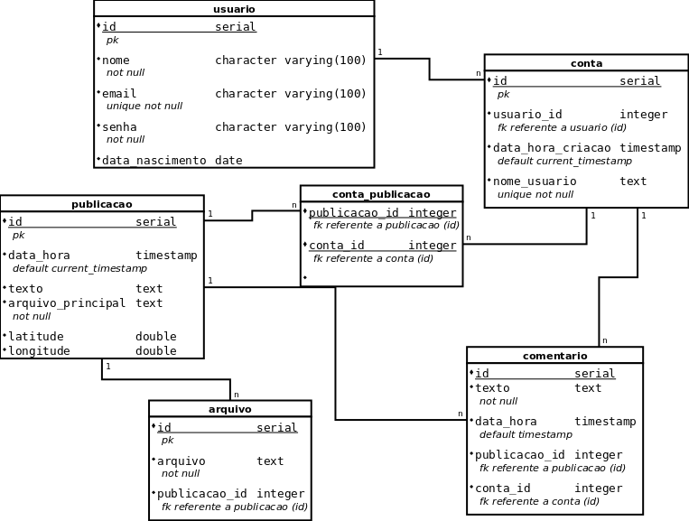

# Trabalho 1

Fazer o script.sql (2.0) e todos os exercícios abaixo (3.0 - cada 0,1):

1) Listar o nome do usuário e o nomes das suas contas
2) Listas as publicações e seus arquivos
3) Listar as publicações e seus comentários
4) Listar somente publicações com comentários
5) Retornar a quantidade de contas por usuário
6) Retornar a quantidade de publicações por usuário
7) Retornar as publicações com mais comentários
8) Retornar publicações que não tem comentários
9) Retornar somente usuários que possuem um única conta
10) Retornar usuários com mais de uma conta sob sua responsabilidade
11) Retornar publicações sem arquivos adicionais (Sem registros na tabela de arquivo)
12) Retornar somente publicações compartilhadas por mais de uma conta
13) Retornar usuários e suas respectivas contas que não criaram nenhuma publicação
14) Retornar usuários que possuem só publicações sem comentários
15) Retornar a conta que mais realizou comentários
16) Retornar o nome do usuário e o nome da conta da última conta criada
17) Retornar usuário(s) que possue(m) a maior quantidade de contas. Retornar pelo menos 1. Nesta questão não obrigatório retornar todos usuários empatados.
<!--18) Retornar usuário(s) que possue(m) a menor quantidade de contas-->
18) Retornar comentários realizados durante a última semana (últimos 7 dias)
19) Retornar as contas do(s) usuário(s) mais velho(s). Retornar todos em caso de empate
20) Listar nos primeiros resultados usuários sem conta acima dos usuários com conta
21) Quantidade total de comentários dado um intervalo de datas
22)  Selecione publicações que tenham mais de um arquivo (fora o obrigatório)
<!--24)  Publicação com maior texto (maior número de caracteres)-->
23)  Publicações com maior número de caracteres (coluna texto). Cuidar a questão do empate, ou seja, 2 ou mais publicações terem o texto com o mesma quantidade de caracteres
24)  Usuário que mais publicou em um dado intervalo de tempo
25)  Conta que mais publicou
26)  Conta que mais compartilhou publicações
27)  Publicação com mais arquivos
28)  Alterar a tabela conta_publicação e adicionar a data e hora em que uma publicação foi compartilhada
29)  Usuário que mais realizou comentários
30)  Conta que mais realizou comentários
<!-- 33)  Formatar o retorno da data e hora-->

